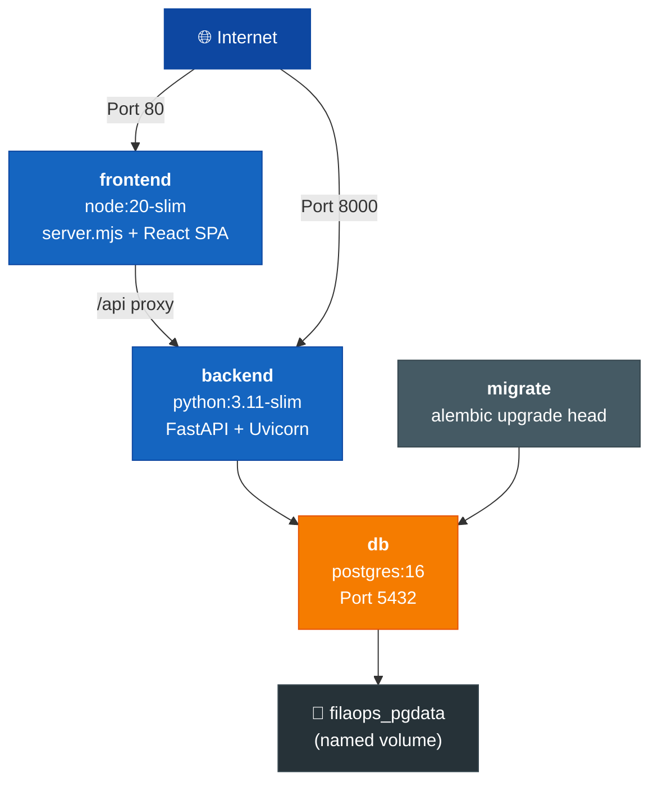

# Deployment & Operations

Guides for deploying, configuring, and maintaining a FilaOps instance in production.

| Guide | Description |
|-------|-------------|
| **[Docker Compose](../DEPLOYMENT.md)** | Full production deployment with Docker Compose — architecture, environment variables, troubleshooting |
| **[Email Setup](../EMAIL_CONFIGURATION.md)** | Configure SMTP for password resets and notifications |
| **[Backup & Recovery](../BACKUP-AND-RECOVERY.md)** | Database backups, file uploads, Docker volume strategies, disaster recovery |
| **[Migration Safety](../MIGRATION-SAFETY.md)** | Pre-deployment checklist and rollback procedures for database migrations |
| **[Rollback](../ROLLBACK.md)** | How to roll back to a previous version |
| **[Versioning](../VERSIONING.md)** | Version numbering scheme and release process |

## Architecture Overview

