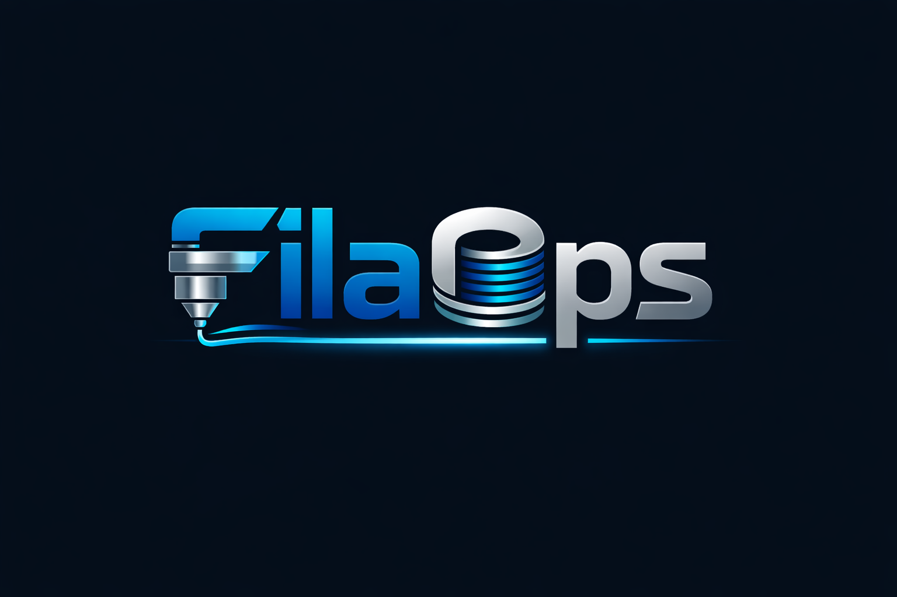

---
hide:
  - navigation
  - toc
---

<style>
.md-typeset h1 { display: none; }

.hero {
  text-align: center;
  padding: 3rem 1rem 2rem;
}

.hero img {
  max-width: 420px;
  width: 100%;
  margin-bottom: 1rem;
}

.hero h2 {
  font-size: 1.6rem;
  font-weight: 400;
  color: var(--md-typeset-color);
  border: none;
  margin-top: 0;
  padding: 0;
}

.hero .hero-tagline {
  font-size: 1.1rem;
  color: rgba(var(--md-typeset-color--light), 0.7);
  margin-bottom: 2rem;
}

.hero-buttons {
  display: flex;
  gap: 1rem;
  justify-content: center;
  flex-wrap: wrap;
  margin: 2rem 0;
}

.hero-buttons a {
  display: inline-flex;
  align-items: center;
  gap: 0.5rem;
  padding: 0.75rem 1.5rem;
  border-radius: 8px;
  font-weight: 600;
  font-size: 0.95rem;
  text-decoration: none;
  transition: transform 0.15s ease, box-shadow 0.15s ease;
}

.hero-buttons a:hover {
  transform: translateY(-2px);
  box-shadow: 0 4px 12px rgba(0, 0, 0, 0.2);
}

.hero-buttons .btn-primary {
  background: var(--blb3d-blue, #1976D2);
  color: #fff !important;
  border: none;
}

.hero-buttons .btn-primary:hover {
  background: var(--blb3d-blue-light, #42A5F5);
}

.hero-buttons .btn-secondary {
  background: transparent;
  color: var(--blb3d-orange, #F57C00) !important;
  border: 2px solid var(--blb3d-orange, #F57C00);
}

.hero-buttons .btn-secondary:hover {
  background: rgba(245, 124, 0, 0.1);
}

.feature-grid {
  display: grid;
  grid-template-columns: repeat(auto-fit, minmax(280px, 1fr));
  gap: 1.5rem;
  margin: 2rem 0;
}

.feature-card {
  padding: 1.5rem;
  border-radius: 8px;
  border: 1px solid rgba(128, 128, 128, 0.2);
  transition: border-color 0.2s ease, box-shadow 0.2s ease;
}

.feature-card:hover {
  border-color: var(--blb3d-blue, #1976D2);
  box-shadow: 0 4px 16px rgba(25, 118, 210, 0.1);
}

.feature-card h3 {
  margin-top: 0;
  font-size: 1.1rem;
  border: none;
  padding: 0;
}

.feature-card p {
  font-size: 0.9rem;
  margin-bottom: 0.5rem;
  opacity: 0.85;
}

.feature-card a {
  font-weight: 600;
  font-size: 0.85rem;
}

.stats-bar {
  display: flex;
  justify-content: center;
  gap: 3rem;
  flex-wrap: wrap;
  margin: 2rem 0;
  padding: 1.5rem;
  border-radius: 8px;
  background: rgba(25, 118, 210, 0.05);
  border: 1px solid rgba(25, 118, 210, 0.15);
}

.stat {
  text-align: center;
}

.stat-number {
  font-size: 2rem;
  font-weight: 800;
  color: var(--blb3d-blue-light, #42A5F5);
  display: block;
}

.stat-label {
  font-size: 0.8rem;
  text-transform: uppercase;
  letter-spacing: 0.08em;
  opacity: 0.7;
}
</style>

<div class="hero" markdown>

# FilaOps



## Open-Source ERP for 3D Print Farms

Manage inventory, production, MRP, sales, purchasing, and accounting — built specifically for additive manufacturing operations.

<div class="hero-buttons">
  <a href="user-guide/installation/" class="btn-primary">
    :material-rocket-launch: Get Started
  </a>
  <a href="https://github.com/Blb3D/filaops" target="_blank" class="btn-secondary">
    :fontawesome-brands-github: View on GitHub
  </a>
</div>

</div>

<div class="stats-bar">
  <div class="stat">
    <span class="stat-number">41</span>
    <span class="stat-label">Core Features</span>
  </div>
  <div class="stat">
    <span class="stat-number">7</span>
    <span class="stat-label">Modules</span>
  </div>
  <div class="stat">
    <span class="stat-number">100%</span>
    <span class="stat-label">Open Source Core</span>
  </div>
</div>

<div class="feature-grid" markdown>

<div class="feature-card" markdown>

### :material-rocket-launch: Getting Started

Install FilaOps, create your admin account, and complete your first workflow in under 10 minutes.

[:octicons-arrow-right-24: Quick start](user-guide/installation.md)

</div>

<div class="feature-card" markdown>

### :material-book-open-variant: User Guide

Step-by-step guides for every module — catalog, sales, inventory, manufacturing, MRP, purchasing, and more.

[:octicons-arrow-right-24: Browse guides](user-guide/index.md)

</div>

<div class="feature-card" markdown>

### :material-server: Deployment

Docker Compose production setup, backups, migrations, email configuration, and operational procedures.

[:octicons-arrow-right-24: Deploy](deployment/index.md)

</div>

<div class="feature-card" markdown>

### :material-code-tags: Developer Reference

API endpoints, database schema, UI components, and conventions for contributors.

[:octicons-arrow-right-24: Reference](reference/index.md)

</div>

</div>

---

## What's Inside

| Module | Highlights |
|--------|-----------|
| **Sales & Quotes** | Quotations, sales orders, fulfillment tracking, order status workflows |
| **Inventory** | Multi-location stock, spool tracking, cycle counting, UOM system, low stock alerts |
| **Manufacturing** | Production orders, BOMs, routings, work centers, QC inspections |
| **MRP** | Material requirements planning, planned orders, BOM explosion, firming |
| **Purchasing** | Vendor management, purchase orders, receiving, cost tracking |
| **Printers & Fleet** | Multi-brand printer management, MQTT monitoring, maintenance scheduling |
| **Accounting** | General ledger, journal entries, trial balance, COGS, tax reporting |

[:octicons-arrow-right-24: Full Feature Catalog](FEATURE-CATALOG.md)

---

## Quick Start

=== "Docker (recommended)"

    ```bash
    git clone https://github.com/Blb3D/filaops.git
    cd filaops
    cp backend/.env.example .env
    docker compose up -d
    ```

    Open [http://localhost](http://localhost) and create your admin account.

=== "Manual"

    ```bash
    # Backend
    cd backend
    python -m venv venv && source venv/bin/activate
    pip install -r requirements.txt
    alembic upgrade head
    uvicorn app.main:app --reload

    # Frontend (separate terminal)
    cd frontend
    npm install && npm run dev
    ```

---

<div style="text-align: center; padding: 2rem 0;" markdown>

**Built by [BLB3D Labs](https://blb3dprinting.com)** · [GitHub](https://github.com/Blb3D/filaops) · [BSL 1.1 License](https://github.com/Blb3D/filaops/blob/main/LICENSE)

</div>
